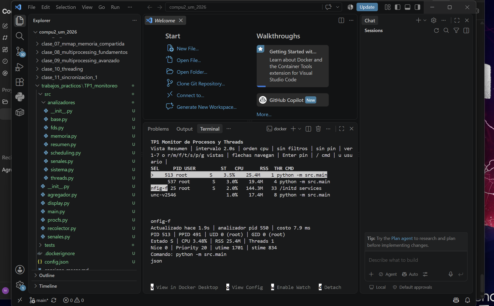

# TP1 - Monitor de Procesos y Threads

Computacion II - Universidad de Mendoza - 2026

## Descripcion general

Este proyecto implementa un monitor de procesos para Linux leyendo `procfs`
directamente desde `/proc`, sin `psutil`, `ps`, `top` ni comandos externos. La
aplicacion muestra una TUI con una tabla de procesos y siete vistas alternables:
resumen, memoria, file descriptors, threads, senales, scheduling y sistema.

La interfaz se maneja con teclado:

- `1` a `7` o `r/m/f/t/s/p/g`: cambiar vista.
- Flechas: navegar procesos.
- `Enter`: fijar/liberar el proceso seleccionado.
- `/`: filtrar por comando.
- `u`: filtrar por usuario.
- `c`: alternar orden CPU, RSS o PID.
- `+` / `-`: ajustar el intervalo de refresco de la vista activa.
- `h` / `?`: ayuda.
- `q`: salir limpiamente.

## Como correr

Desde esta carpeta:

```bash
docker compose up --build
```

Si abriste el repositorio completo en VS Code y estas parado en
`compu2_um_2026`, tambien funciona:

```bash
docker compose up --build
```

porque hay un `docker-compose.yml` en la raiz que apunta a este TP.

El compose usa `tty: true`, `stdin_open: true` y `pid: host` para que la TUI sea
interactiva y el monitor pueda ver mas procesos desde el contenedor. En Docker
Desktop puede depender de la plataforma; en Linux nativo es el caso esperado.

Tambien se puede ejecutar un snapshot no interactivo:

```bash
python run.py --once --seconds 3
```

No ejecutes archivos internos como `src/analizadores/memoria.py` desde el boton
de play de VS Code: esos modulos son usados por el monitor principal. El
entrypoint correcto es `run.py` o `python -m src.main`.

## VS Code

El repo trae `.vscode/tasks.json` y `.vscode/launch.json`:

- `Terminal > Run Task... > TP1: docker compose up` levanta el monitor con
  Docker.
- `Run and Debug > TP1: snapshot local` ejecuta un snapshot corto.
- `Run and Debug > TP1: monitor TUI` intenta abrir la TUI desde Python local.

En Windows, la TUI real necesita Docker o WSL porque depende de `/proc` y
`curses`. Si la terminal muestra `docker: no se reconoce...`, falta instalar
Docker Desktop o agregarlo al PATH.

## Como testear

```bash
python -m unittest discover -s tests
```

Los tests se concentran en parseo de `/proc`: `stat`, `status`, mascaras de
senales, jiffies de CPU y `meminfo`.

Dentro de Docker:

```bash
docker compose run --rm monitor python -m unittest discover -s tests
```

## Captura de pantalla



## Diagrama de arquitectura

```text
                         +------------------------------+
                         | Manager.dict snapshot global |
                         | protegido con Manager.RLock  |
                         +---------------^--------------+
                                         |
                              Queue      | escribe
                         +---------------+--------------+
                         |        agregador             |
                         | recibe resultados y dumps    |
                         +------^----------------+------+
                                |                |
                           Queue|                |Pipe control
                                |                |
 +------------+      +----------+----------+     |
 | recolector | ---> | 7 analizadores      |     |
 | lista /proc|Queue | resumen/mem/fd/...  |     |
 +------------+      +----------+----------+     |
                                |                |
                                v                v
                         +------------------------------+
                         | Display curses en proceso    |
                         | principal: lee snapshot      |
                         +------------------------------+
```

El recolector solo distribuye listas de PID. Cada analizador es un proceso
independiente con su propio intervalo y lee la parte de `/proc` que le toca. El
agregador es el unico escritor del snapshot compartido. El display lee ese
snapshot y modifica intervalos por `multiprocessing.Value`.

## Decisiones de diseno

**Queue para datos frecuentes.** El recolector envia listas de PID a cada
analizador con `Queue`, y los analizadores devuelven resultados al agregador con
otra `Queue`. Es un patron productor-consumidor natural: si una vista tarda mas,
no bloquea a las demas.

**Pipe para control.** Las acciones puntuales desde el proceso principal hacia
el agregador (`dump`, eventos de seniales) viajan por `Pipe`. Es un canal simple
punto a punto, mas claro que mezclar control con la cola de datos.

**Manager.dict para snapshot.** El snapshot tiene estructuras anidadas y de
tamanio variable: listas de FDs, threads, mapas de memoria, top de procesos. Un
`Value` o `Array` no alcanza para esa forma de datos; `Manager.dict` permite que
procesos distintos compartan una vista coherente.

**Value para intervalos.** Cada intervalo es un numero simple y mutable en
tiempo real. Por eso cada vista tiene un `multiprocessing.Value("d")`, protegido
por su lock interno cuando se lee o se escribe.

**Array para contadores de senales.** Las senales recibidas por el monitor se
cuentan en un `multiprocessing.Array("i")`, con un indice fijo por senal. Es un
caso chico, numerico y de tamanio fijo.

**Race conditions.** La carrera principal seria que varios procesos escriban el
snapshot a la vez. Se evita con dos decisiones: solo el agregador escribe, y
cada escritura se hace dentro de `Manager.RLock`. Los intervalos se modifican
con el lock interno de cada `Value`. El handler de seniales no toca estructuras
complejas: usa `signal.set_wakeup_fd`, y el loop principal procesa la accion
despues.

**Intervalos default.** Las vistas livianas (`resumen`, `threads`, `sistema`)
refrescan cada 2 segundos. Memoria refresca cada 3 porque parsear `maps` es mas
caro. FDs refresca cada 5 y senales/scheduling cada 10 porque cambian menos y
requieren menos sensacion de tiempo real.

## Decisiones sobre la TUI

Use `curses` porque viene en la libreria estandar de Python en Linux y evita
agregar dependencias externas. La pantalla se divide en dos zonas fijas: arriba
siempre esta la lista resumida de procesos, y abajo se renderiza el detalle de
la vista activa. Esa separacion permite cambiar de vista sin perder contexto
sobre que proceso esta seleccionado.

La tabla superior se ordena en el display, no en los analizadores. Asi los
procesos hijos se concentran en recolectar datos y el usuario puede alternar
CPU/RSS/PID localmente sin forzar trabajo extra en todos los analizadores. Los
filtros por comando y usuario tambien viven en la TUI porque son decisiones de
presentacion.

El modo verbose se maneja con `SIGUSR2` y afecta principalmente a vistas con
listas largas, como FDs y threads. En modo normal se limita la cantidad de filas
para que la terminal siga siendo legible.

## Conceptos del curso aplicados

- Procesos y `/proc`: `src/procfs.py` lista `/proc/<pid>` y parsea `stat`,
  `status`, `cmdline`, `maps`, `fd` y `task`.
- `fork`, `exec`, `wait` y zombies: la vista sistema cuenta estados desde
  `/proc/<pid>/stat`; un zombie aparece como estado `Z`.
- File descriptors: `src/procfs.py::read_fds` usa `os.readlink` sobre
  `/proc/<pid>/fd/<n>` e infiere `socket`, `pipe`, `tty`, `file`, etc.
- Threads como LWPs: la vista `threads` recorre `/proc/<pid>/task/<tid>` y
  calcula CPU por TID.
- Senales: `src/analizadores/senales.py` decodifica `SigBlk`, `SigIgn`,
  `SigCgt`, `SigPnd` y `ShdPnd`; `src/senales.py` maneja senales del monitor
  con `set_wakeup_fd`.
- IPC: `Queue`, `Pipe`, `Manager.dict`, `Value` y `Array` aparecen en
  `src/main.py`.
- Scheduler: `src/analizadores/scheduling.py` muestra nice, priority, policy,
  RT priority, affinity, SID, PGID y context switches.
- Race conditions y sincronizacion: el agregador centraliza escrituras y usa
  `Manager.RLock`; los intervalos usan locks internos de `Value`.

## Senales soportadas

- `SIGINT` / `SIGTERM`: shutdown limpio de procesos hijos.
- `SIGHUP`: recarga `config.json` y aplica intervalos, filtros y orden default.
- `SIGUSR1`: escribe `dump_<timestamp>.json` con el snapshot actual.
- `SIGUSR2`: alterna modo verbose, mostrando mas FDs y threads.
- `SIGWINCH`: registra resize de terminal y fuerza repintado en la TUI.

Con el monitor levantado, se pueden probar desde otra terminal:

```bash
docker compose kill -s SIGUSR1 monitor
docker compose kill -s SIGUSR2 monitor
docker compose kill -s SIGHUP monitor
docker compose kill -s SIGTERM monitor
```

`SIGUSR1` crea un archivo `dump_<timestamp>.json` en la carpeta del TP porque el
directorio esta montado como volumen dentro del contenedor.

## Limitaciones conocidas

- El monitor esta pensado para Linux. En Windows o macOS no existe el mismo
  `procfs`.
- Algunos procesos ajenos pueden negar lectura de `fd`, `maps` o `status` por
  permisos del kernel; el monitor lo muestra como error de lectura y sigue.
- CPU% necesita al menos dos muestras para mostrar un delta real, por eso al
  inicio puede verse en cero.
- `pid: host` puede comportarse distinto en Docker Desktop que en Linux nativo.
- Si el sistema tiene miles de procesos o muchisimos FDs, las vistas mas caras
  pueden tardar mas; por eso tienen intervalos mayores.
- Si se mata manualmente un analizador hijo, el monitor principal sigue vivo
  pero esa vista queda con el ultimo snapshot hasta reiniciar el monitor. La TUI
  muestra la antiguedad de cada snapshot para detectar ese caso.

## Bonus implementados

- Tests unitarios de parseo de `/proc`.
- Modo snapshot no interactivo con `python run.py --once --seconds 3`, util para
  debug o exportacion manual a JSON.
- Dump on-demand con `SIGUSR1`.
- Indicador en pantalla de senales recibidas por el monitor.

## Lo que aprendi

Al desarrollar este TP, lo mas importante fue entender que `/proc` no da datos
"listos para mostrar": hay que parsear formatos distintos, tolerar procesos que
desaparecen mientras se leen, y calcular valores derivados como CPU% usando
deltas. Por eso el codigo separa helpers de parseo, analizadores y display.

Tambien quedo claro que compartir memoria entre procesos no es lo mismo que
compartir objetos entre threads. Un `dict` normal no sirve como snapshot global
porque cada proceso tiene su propio espacio de memoria; por eso se usa
`Manager.dict` y un agregador unico para centralizar escrituras.

Otra idea que quedo mas clara es que los threads en Linux tambien aparecen como
entidades planificables dentro de `/proc/<pid>/task`. Eso conecta la vista de
threads con los conceptos de LWP, GIL y context switches vistos en clase.

## Aprendizajes para defender

Conviene poder explicar con tus palabras por que el campo `comm` de
`/proc/<pid>/stat` se parsea buscando el ultimo `)`, por que puede tener espacios
o parentesis. Tambien hay que poder justificar por que el porcentaje de CPU se
calcula con deltas de jiffies y no leyendo un valor absoluto.

Otro punto clave es distinguir PID y TID: en Linux los threads se ven como LWPs
dentro de `/proc/<pid>/task`, y cada TID tiene su propio `stat`, `status` y
contadores de context switches. Esa vista conecta directamente con GIL,
threading y scheduler.

Por ultimo, hay que tener clara la razon del agregador: no esta solo para
ordenar codigo, sino para reducir carreras. Si todos los analizadores escribieran
el mismo diccionario compartido, seria mas dificil razonar sobre consistencia.
